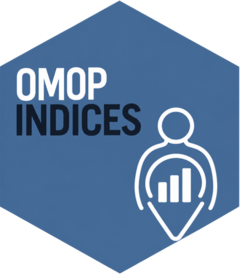

<!-- README.md is generated from README.Rmd. Please edit that file -->

# OmopIndices <a href="https://OHDSI.github.io/OmopIndices/"></a>

<!-- badges: start -->

[](https://lifecycle.r-lib.org/articles/stages.html#stable)
<!-- [](https://CRAN.R-project.org/package=OmopIndices) -->
[](https://github.com/OHDSI/OmopIndices/actions/workflows/R-CMD-check.yaml)
[](https://app.codecov.io/gh/OHDSI/OmopIndices)
<!-- badges: end -->

The goal of **OmopIndices** is to enable standardised and reproducible
derivation of clinically and epidemiologically relevant patient-level
indices and covariates directly from OMOP CDM database instances.

## Ecosystem

*OmopIndices* is part of the ecosystem of packages defined by
[omopgenerics](https://darwin-eu.github.io/omopgenerics/). For more
details on the ecosystem you can read the [Tidy R programming with the
OMOP Common Data
Model](https://ohdsi.github.io/Tidy-R-programming-with-OMOP/) book.

## Tested sources

| Source | Driver | CDM reference | Status |
|----|----|----|----|
| Local R data frame | N/A | `omopgenerics::cdmFromTables()` |  |
| In-memory DuckDB database | duckdb | `CDMConnector::cdmFromCon()` |  |

## Installation

You can install the CRAN version of OmopIndices as:

``` r
install.packages("OmopIndices")
```

Or you can install the development version of OmopIndices from
[GitHub](https://github.com/) with:

``` r
# install.packages("pak")
pak::pkg_install("OHDSI/OmopIndices")
```

## Main functionality

OmopIndices adds patient-level measures to an existing `cdm_table`. Each
function returns the input table with one or more columns added, so
functions can be composed with the pipe operator. The input table must
contain `person_id` or `subject_id` and, for index-based measures, a
`Date` column that identifies the index date.

| Group | Functions | Output |
|----|----|----|
| Comorbidity and frailty | `addCharlsonIndex()`, `addUpdatedCharlsonIndex()`, `addElectronicFrailtyIndex()`, `addHospitalFrailtyRiskScore()` | Numeric score, optionally with a categorical column |
| Clinical covariates | `addBMI()`, `addPolypharmacy()` | BMI and maximum simultaneous ingredient count |
| Demographics | `addEthnicity()`, `addLocation()` | Person-level ethnicity and location fields |
| Socioeconomic status | `addSocioEconomicStatus()`, `addTownsend()`, `addIndexOfMultipleDeprivation()` | Townsend or IMD value |

The index functions use OMOP concepts from the supplied `conceptSet` to
find records in the requested window. By default, the package uses
internal concept sets that can be inspected using `getIndexCodelist()`.
A concept set can also be supplied as a `codelist`,
`codelist_with_details`, or `concept_set_expression` object.

## Examples

The examples below use the *GiBleed* database bundled with the
[omock](https://ohdsi.github.io/omock/) package. Each group starts from
the same mock cohort, and the examples can be adapted to any compatible
OMOP CDM table. For index-based measures, the default index date is
`cohort_start_date`; use `indexDate` to select another `Date` column.
Windows are expressed in days relative to the index date, so
`c(-365, 0)` means the year before and including the index date.

``` r
library(omock)
library(duckdb)
library(OmopIndices)
library(dplyr)
library(CohortConstructor)

cdm <- mockCdmFromDataset(datasetName = "GiBleed", source = "duckdb")

# Let's create a simple sinusitis cohort for the examples
cdm$cohort <- conceptCohort(
  cdm = cdm,
  conceptSet = list(sinusitis = c(257012L, 4283893L, 4294548L, 40481087L)),
  name = "cohort"
)
```

### Comorbidity and frailty

The comorbidity and frailty functions add a numeric score. The Charlson
and updated Charlson functions can optionally include age adjustment,
and the frailty scores can also add a categorical classification of the
score. The package provides default categories for the Electronic
Frailty Index and Hospital Frailty Risk Score; these can be overridden
with `categories`.

``` r
comorbidity <- cdm$cohort |>
  addCharlsonIndex(ageAdjusted = TRUE) |>
  addUpdatedCharlsonIndex(ageAdjusted = TRUE) |>
  addElectronicFrailtyIndex() |>
  addHospitalFrailtyRiskScore(
    categories = list(
      low = c(0, 5),
      intermediate = c(5, 15),
      high = c(15, Inf)
    )
  )

comorbidity |>
  select(subject_id, cohort_start_date, charlson, updated_charlson, efi,
         efi_categories, hfrs, hfrs_categories) |>
  glimpse()
#> Rows: ??
#> Columns: 8
#> Database: DuckDB 1.5.5 [root@Darwin 25.6.0:R 4.4.1//private/var/folders/pl/k11lm9710hlgl02nvzx4z9wr0000gp/T/Rtmp5pfEVs/file15da6d47cdf9.duckdb]
#> $ subject_id        <int> 2859, 5165, 1250, 3241, 1381, 4403, 1945, 5309, 4521…
#> $ cohort_start_date <date> 1982-07-04, 2010-11-09, 1994-01-09, 2002-08-02, 201…
#> $ charlson          <dbl> 1, 0, 0, 2, 2, 4, 0, 0, 5, 0, 1, 3, 0, 0, 0, 0, 1, 0…
#> $ updated_charlson  <dbl> 0, 0, 0, 0, 1, 3, 0, 0, 6, 0, 0, 2, 0, 0, 0, 0, 0, 0…
#> $ efi               <dbl> 0.08333333, 0.11111111, 0.11111111, 0.11111111, 0.11…
#> $ efi_categories    <chr> "fit", "fit", "fit", "fit", "fit", "fit", "fit", "fi…
#> $ hfrs              <dbl> 0.0, 0.0, 0.0, 0.0, 0.0, 0.0, 1.5, 0.0, 11.1, 0.0, 0…
#> $ hfrs_categories   <chr> "low", "low", "low", "low", "low", "low", "low", "lo…
```

Each index uses an internal concept set by default. To apply a
study-specific definition, supply a named `conceptSet` containing the
required codelists. The available internal codelists can be inspected
with `getIndexCodelist()`.

``` r
getIndexCodelist("charlson")
#> 
#> - aids (11 codes)
#> - any_malignancy (716 codes)
#> - cerebrovascular_disease (129 codes)
#> - chronic_pulmonary_disease (92 codes)
#> - congestive_heart_failure (41 codes)
#> - connective_tissue_disease (60 codes)
#> along with 11 more codelists
```

### Clinical covariates

`addBMI()` selects a BMI measurement from a time window, while
`addPolypharmacy()` calculates the maximum number of simultaneous drug
ingredients in its window. Here BMI is taken from the last measurement in the
preceding year and polypharmacy is assessed over the preceding 30 days.

``` r
clinical <- cdm$cohort |>
  addBMI(window = c(-365, 0), order = "last") |>
  addPolypharmacy(window = c(-30, 0))

clinical |>
  select(subject_id, cohort_start_date, bmi, polypharmacy) |>
  glimpse()
#> Rows: ??
#> Columns: 4
#> Database: DuckDB 1.5.5 [root@Darwin 25.6.0:R 4.4.1//private/var/folders/pl/k11lm9710hlgl02nvzx4z9wr0000gp/T/Rtmp5pfEVs/file15da6d47cdf9.duckdb]
#> $ subject_id         <int> 2859, 5165, 3241, 1381, 4403, 1242, 3083, 410, 5276…
#> $ cohort_start_date  <date> 1982-07-04, 2010-11-09, 2002-08-02, 2010-08-08, 19…
#> $ bmi                <int> NA, NA, NA, NA, NA, NA, NA, NA, NA, NA, NA, NA, NA,…
#> $ polypharmacy       <int> 2, 2, 2, 2, 2, 2, 2, 2, 2, 2, 2, 2, 2, 2, 2, 2…
```

### Demographics

`addEthnicity()` uses available ethnicity and race fields from the OMOP
`person` table in sequence. `addLocation()` first uses `location_id` and
then falls back to the location associated with `care_site_id`. Missing
values can be replaced with study-specific labels.

``` r
demographics <- cdm$cohort |>
  addEthnicity(missingEthnicityValue = "Unknown") |>
  addLocation(
    from = c("location_id", "care_site_id"),
    locationSource = "location_source_value",
    missingLocationValue = "Unknown"
  )

demographics |>
  select(subject_id, cohort_start_date, ethnicity, location) |>
  glimpse()
#> Rows: ??
#> Columns: 4
#> Database: DuckDB 1.5.5 [root@Darwin 25.6.0:R 4.4.1//private/var/folders/pl/k11lm9710hlgl02nvzx4z9wr0000gp/T/Rtmp5pfEVs/file15da6d47cdf9.duckdb]
#> $ subject_id        <int> 2859, 5165, 3241, 1381, 4403, 1242, 3083, 410, 5276,…
#> $ cohort_start_date <date> 1982-07-04, 2010-11-09, 2002-08-02, 2010-08-08, 199…
#> $ ethnicity         <chr> "Unknown", "Unknown", "Unknown", "Unknown", "Unknown…
#> $ location          <chr> "Unknown", "Unknown", "Unknown", "Unknown", "Unknown…
```

### Socioeconomic status

Socioeconomic status can be derived from Townsend deprivation scores,
the Index of Multiple Deprivation (IMD), or a prioritised combination of
both. The following example retains the two source-specific outputs and
also creates a combined value that prefers IMD and falls back to
Townsend.

``` r
socioeconomic <- cdm$cohort |>
  addTownsend(nameStyle = "townsend") |>
  addIndexOfMultipleDeprivation(nameStyle = "imd") |>
  addSocioEconomicStatus(
    from = c("imd", "townsend"),
    nameStyle = "socio_economic_status"
  )

socioeconomic |>
  select(subject_id, cohort_start_date, townsend, imd,
         socio_economic_status) |>
  glimpse()
#> Rows: ??
#> Columns: 5
#> Database: DuckDB 1.5.5 [root@Darwin 25.6.0:R 4.4.1//private/var/folders/pl/k11lm9710hlgl02nvzx4z9wr0000gp/T/Rtmp5pfEVs/file15da6d47cdf9.duckdb]
#> $ subject_id            <int> 2859, 5165, 3241, 1381, 4403, 1242, 3083, 410, 5…
#> $ cohort_start_date     <date> 1982-07-04, 2010-11-09, 2002-08-02, 2010-08-08,…
#> $ townsend              <chr> "Missing", "Missing", "Missing", "Missing", "Mis…
#> $ imd                   <chr> "Missing", "Missing", "Missing", "Missing", "Mis…
#> $ socio_economic_status <chr> "Missing", "Missing", "Missing", "Missing", "Mis…
```

The default codelists and output names are suitable for exploratory use,
but for a reproducible analysis you should specify the concept set, date
window, selection order, and output name required by the study protocol.

## Function reference

See the [reference site](https://ohdsi.github.io/OmopIndices/reference/)
for complete argument descriptions, accepted input types, and examples
for every exported function. The package is tested with local data
frames and DuckDB in continuous integration. It is designed to work with
database-backed OMOP CDM sources supported by
[omopgenerics](https://darwin-eu.github.io/omopgenerics/) and
[CDMConnector](https://darwin-eu.github.io/CDMConnector/); verify any
additional backend in the target deployment environment.
